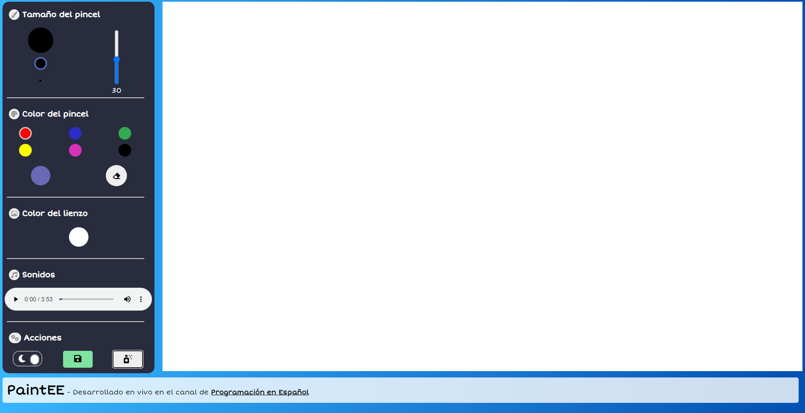

# [Paintee Web App](https://pedrovelasquez9.github.io/paintee/)

    
    <h1>Programación en español</h1>

## Preview

[Launch app](https://pedrovelasquez9.github.io/paintee/)

## About

### Powered by JavaScript

Interactive painting board developed with **HTML, CSS and JavaScript** using **Canvas API** in live sessions on Programacion en español's [Twitch Channel](https://www.twitch.tv/programacion_en_esp).

## How to start?

To run the project, clone the repository and open the **index.html** file with your browser or a live server, you can use **live server VSCode extension**

## Want to collaborate with the project?

If you wish to collaborate, you can **fork** the project in order to work in your environment. Once you're ready to go, you can launch a PR to **develop branch** of this repository

## Join the community

    
    
    
    
    
    
    

